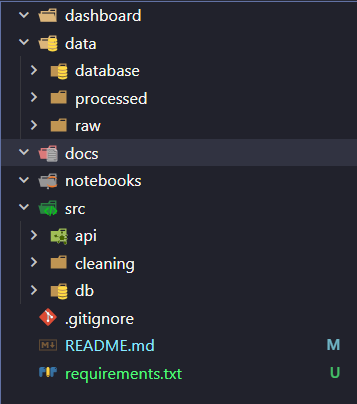

# Industry Trends(2011-2024)
An end-to-end data engineering and analytics platform that transforms 14 years of raw survey data into interactive, data-driven insights.
## The Mission...
The Stack Overflow Annual Survey is the most comprehensive data source on developer life, but its schema changes yearly. This project builds a **unified analytical layer** to track the evolution of the software industry over a decade.
## Tech Stack & Architecture
**Data Orchestration:** Python(Pandas) for ETL. 
**Analytical Engine:** [DuckDB](https://duckdb.org/) for high-performance, in-process OLAP. 
**Backend API:** FastAPI for serving standard metrics. 
**Frontend:** Streamlit for comprehensive and interactivew data exploration. 
**Storage:** Parquet for efficient,compressed data versioning.
## Roadmap-->
**Phase 1: Foundation-** Initialize repo,DuckDB setup and .gitignore. 
**Phase 2: ETL & Normalization-** Map historical columns to a "Gold Standard" schema. 
**Phase 3: Analytical Layer-** Build SQL views in DuckDB for multi-year trends. 
**Phase 4: Presentation-** Deploy FastAPI and Streamlit Dashboard.
## Repo Strucutre:

## Setup & Installation:
1. Clone the repo.
2. Place raw CSVs in 'data/raw'.
3. 'pip install -r requirements.txt'